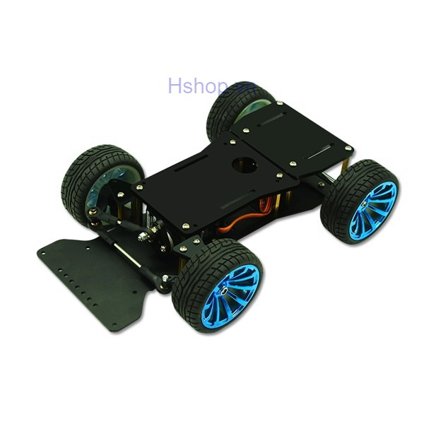

# Autonomous car powered by Nvidia Jetson Nano
Nvidia Jetson Nano controlled car with camera

This project at AISVN helps with machine learning, object detection, inference, computer vision (OpenCV) and artificial intelligence. It uses the 128 CUDA cores of the Nvidia Jetson Nano.

Base is this car model unit from [hshop.vn](https://hshop.vn/products/khung-xe-robot-kim-loai-racing-car-1)

