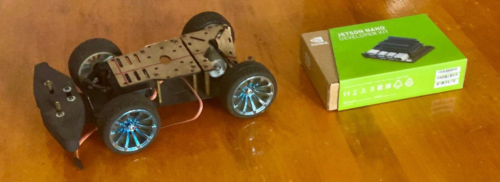
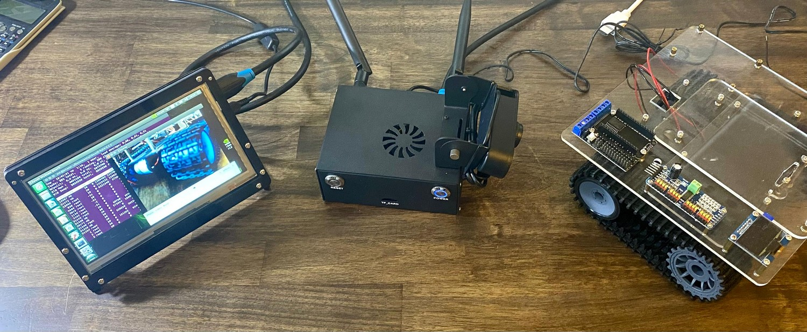

# Autonomous car powered by Nvidia Jetson Nano

This project was planned at AISVN at the end of 2019 to help with machine learning, object detection, inference, computer vision (OpenCV) and artificial intelligence. It uses the 128 CUDA cores of the Nvidia Jetson Nano. The base is a 1:12 model car.

## Hardware

Base is this car model unit from [hshop.vn](https://hshop.vn/products/khung-xe-robot-kim-loai-racing-car-1) for 790.000 VND.

Alternative: [Similar designs](https://tae.vn/khung-robot-do-line) from [TAE.VN](https://tae.vn/). Custom aluminium CNC design available after TET 2020:

 

<!--

-->

## Machine learning and TensorFlow

For historic reasona (AlexNet 2012 used CUDA) Google decided to base their hardware acceleration for [TensorFlow](https://en.wikipedia.org/wiki/TensorFlow), [Keras](https://en.wikipedia.org/wiki/Keras) and [cuDNN](https://developer.nvidia.com/cudnn) on [CUDA](https://en.wikipedia.org/wiki/CUDA) - for many other deep-learning software projects this is [an important feature](https://en.wikipedia.org/wiki/Comparison_of_deep-learning_software). So we look for a GPU with CUDA cores. It happens to be that I have several, but not all are suitable:

|     GPU name    | CUDA cores | Compute Capability | at           |
|:---------------:|-----------:|:------------------:|--------------|
| Jetson Nano     |        128 |         5.3        |              |
| M1000M          |        512 |         5.0        | Zbook 15 G3  |
| GTX960          |       1024 |         5.2        | hp Z600      |
| RTX3070 Ti      |       6144 |         8.6        | i3 10100     |

Note that to install the Nvidia CUDA driver for tensorflow you need at least a CC (Compute Capability) of 3.5 or if you compile the source for yourself at least 3.0.

## Setup

The car has a 7 inch 1024x600 IPS HDMI display, connected to the Jetson Nano and is powered by a 10000 mAh battery pack with two 5V 2A outlets. The wireless network had to be added and now the Jetson is equipped with a AC8265 card for WiFi5 and Bluetooth 4.2. More to come 2024-07-09

## History

### Inspirations and Development

Real-time object detection and classification with edge computing hardware became imaginable in the early 20th century. The changes were really fast. The stages are:

#### Labeled images - 2007 ImageNet

As [Fei Fei Li](https://en.wikipedia.org/wiki/Fei-Fei_Li) explains in her TET talk (link below) they started in 2007 to classify around 1,000,000,000 pictures and used [Amazon Mechanical Turk](https://en.wikipedia.org/wiki/Amazon_Mechanical_Turk) with 48,940 workers in 167 countries to create the image database. By 2009 the database had 15,000,000 labeled images in 22,000 categories. And funding back then was a problem!

#### Classification - 2012 AlexNet

To win the ImageNet 2012 challenge [AlexNet](https://en.wikipedia.org/wiki/AlexNet) used __GPUs__ for its convolutional neural network CNN. It's running on CUDA. This competition ILSVRC started in 2010 and ran until 2017. The creator of ImageNet Fei Fei Li gave an [inspiring TED talk in 2015](https://www.youtube.com/watch?v=40riCqvRoMs). Self driving cars are mentioned at minute 1:30. And how much a three-year old can outperform a computer. Elon Musk has been saying since 2014 that autonomous driving is just a year away.

#### Object detection - 2017 YOLO

The [TED Talk from August 2017](https://www.youtube.com/watch?v=Cgxsv1riJhI) by Joseph Redmon from Washington University inspired ideas and possibilities. In his talk he talked about the application for self driving cars. It certainly makes it imaginable, and it was just running on his laptop! A student at [HCMUTE](https://en.wikipedia.org/wiki/Ho_Chi_Minh_City_University_of_Technology_and_Education) used this [YOLO](https://www.youtube.com/watch?v=MPU2HistivI) (You Only Look Once) software with an NVidia graphics card in his master thesis 2018 for a part in developing an autonomous car. But the [GTX 980](https://en.wikipedia.org/wiki/GeForce_900_series) with 2048 CUDA cores needs 165 Watt power to work. The power requirement is a challenge for a mobile application.

#### Mobile affordable platform - 2019 Jetson Nano

Nvidia had the Jetson TK1 platform already created in 2014, but it was power hungry and expensive. But for just 100 Dollars the Jetson Nano was announced in 2019 to be affordable for student projects with just using 5-10 Watt. We applied for a project at hackster.io. But ultimately we ordered a 4GB development platform at the end of 2019 for student projects.

The drive base from TAE was delayed early 2020 because of the starting COVID-19 pandemic and shipments from China. But eventually we got the drive base. Yet the project stalled from 2020-2024.

#### Challenges of self driving - 2024

It seemed like the combination of object detection and classification was the main problem making self-driving cars possible, together with latency. As it turns out, there is much more to do. Additional sensors like LIDAR really help, even Tesla finally gave in. And here are some example videos to show whats possible and what is still challenging:

- [Why self-driving cars have stalled | It's Complicated](https://www.youtube.com/watch?v=4sCK-a33Nkk) by The Guardian September 2022
- [I RACED My Self-Driving RC Car](https://www.youtube.com/watch?v=zuyOdaQ2xuw) by Steven Gong in July 2023, taking part in the [F1 tenth](https://f1tenth.org/) race 2023, but they use Jetson Xavier NX from 2020, at least 3x more powerfull than the Nano (Volta instead of Maxwell, 21 TOPS) and with $399 4x more expensive
- [Sorry. Your Car Will Never Drive You Around.](https://www.youtube.com/watch?v=2DOd4RLNeT4) - from January 2024, self driving cars are 8 times __less__ save than humans, see data at minute 15 and 11.3 deaths per 100 million miles for Tesla FSD versus 1.35 deaths for humans
- [Video First AI powered Race - A2RL Abu Dhabi](https://www.youtube.com/watch?v=feTxamTHQAA) - disaster 2024-04-28 [https://a2rl.io/](https://a2rl.io/)

#### Reactivation of the Jetson Nano Project

In early 2024 I finished assembling the Jetson Nano into the enclosure I purchased in 2020, together with the Wifi card, antenna and camera. It turns out the [5MP Raspberry Pi camera Rev 1.3](https://www.thegioiic.com/camera-5mp-raspberry-pi) with the OV5647 is not compatible with the Jetson Nano! I have two and can't get them to work. But I have a 720p USB webcam with 90 degrees FOV that should work as well.

#### TODO

We need to do many things:

- drive base
- API to communicate
- base to mount the Jetson Nano, power supply and 7 inch screen
- [Custom Object detection](https://www.youtube.com/watch?v=kJpLMBqNcIQ) - video from August 2021 for the Jetson Nano

#### CUDA 

|     GPU name    | CUDA cores | Compute Capability | at           |
|:---------------:|-----------:|:------------------:|--------------|
| Quadro NVS 140M |         16 |         1.1        | Thinkpad T61 |
| Quadro FX580    |         32 |         1.1        | hp Z600      |
| GTX 650         |        384 |         3.0        | hp Z600      |
| Jetson Nano     |        128 |         5.3        |              |
| GT750M          |        384 |         3.0        | MBPr15 2014  |
| M1000M          |        512 |         5.0        | Zbook 15 G3  |
| GTX960          |       1024 |         5.2        | hp Z600      |
| RTX3070 Ti      |       6144 |         8.6        | i3 10100     |
