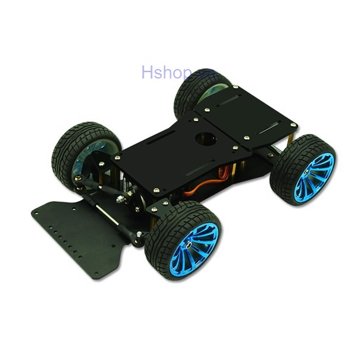
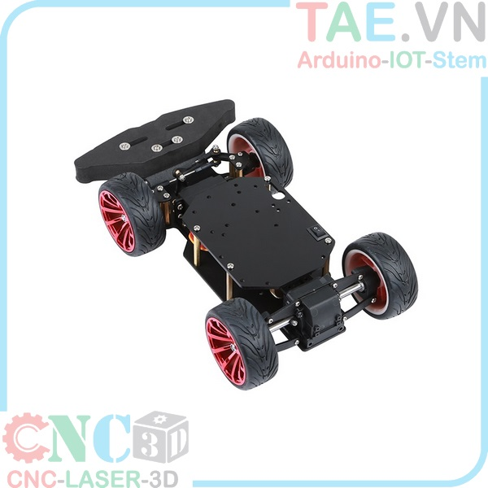

# Autonomous car powered by Nvidia Jetson Nano

Nvidia Jetson Nano controlled car with camera

This little 1:12 model car is controlled by a Nvidia Jetson nano to drive autonomounsly with object detection.

This project was planned at AISVN at the end of 2019 to help with machine learning, object detection, inference, computer vision (OpenCV) and artificial intelligence. It uses the 128 CUDA cores of the Nvidia Jetson Nano.

## Hardware

Base is this car model unit from [hshop.vn](https://hshop.vn/products/khung-xe-robot-kim-loai-racing-car-1) for 790.000 VND.

Alternative: [Similar designs](https://tae.vn/khung-robot-do-line) from [TAE.VN](https://tae.vn/). Custom aluminum CNC design available after TET 2020:

## Machine learning and TensorFlow

For whatever reason Google deceided to base their hardware acceleration for [TensorFlow](https://en.wikipedia.org/wiki/TensorFlow), [Keras](https://en.wikipedia.org/wiki/Keras) and [cuDNN](https://developer.nvidia.com/cudnn) on [CUDA](https://en.wikipedia.org/wiki/CUDA) - for many other deep-learning software projects this is [an important feature](https://en.wikipedia.org/wiki/Comparison_of_deep-learning_software). So we look for a GPU with CUDA cores. It happens to be that I have several, but not all are suitable:

|     GPU name    | CUDA cores | Compute Capability | at           |
|:---------------:|-----------:|:------------------:|--------------|
| Quadro NVS 140M |         16 |         1.1        | Thinkpad T61 |
| Quadro FX580    |         32 |         1.1        | hp Z600      |
| GTX 650         |        384 |         3.0        | hp Z600      |
| Jetson Nano     |        128 |         5.3        |              |
| GT750M          |        384 |         3.0        | MBPr15 2014  |
| M1000M          |        512 |         5.0        | Zbook 15 G3  |
| GTX960          |       1024 |         5.2        | hp Z600      |

Note that to install the Nvidia CUDA driver for tensorflow you need at least a CC (Compute Capability) of 3.5 or if you compile the source for yourself at least 3.0.

## Setup

The car has a 7 inch 1024x600 IPS HDMI display, connected to the Jetson Nano and is powered by a 10000 mAh battery pack with two 5V 2A outlets. The wireless netword had to be added and now the Jetson is equipped with a AC8265 card for WiFi5 and Bluetooth 4.2.
